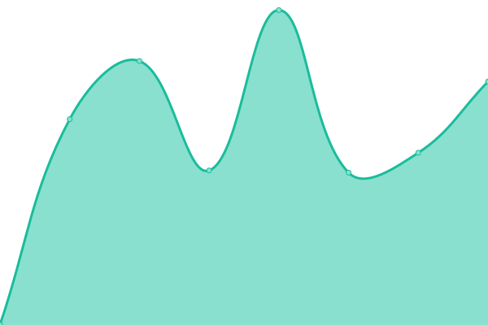
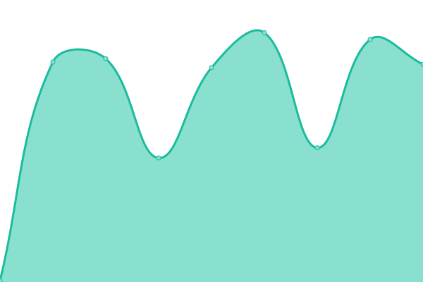
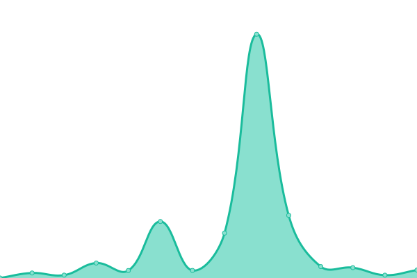

# [📈 Live Status](https://status.szzn.dev): <!--live status--> **🟧 Partial outage**

This repository contains the open-source uptime monitor and status page for [Cong Shuhao 从书豪](https://status.szzn.dev), powered by [Upptime](https://github.com/upptime/upptime).

With [Upptime](https://upptime.js.org), you can get your own unlimited and free uptime monitor and status page, powered entirely by a GitHub repository. We use [Issues](https://github.com/congnews/upuptime/issues) as incident reports, [Actions](https://github.com/congnews/upuptime/actions) as uptime monitors, and [Pages](https://status.szzn.dev) for the status page.

<!--start: status pages-->
<!-- This summary is generated by Upptime (https://github.com/upptime/upptime) -->
<!-- Do not edit this manually, your changes will be overwritten -->
<!-- prettier-ignore -->
| URL | Status | History | Response Time | Uptime |
| --- | ------ | ------- | ------------- | ------ |
|  RSSHub | 🟩 Up | [rss-hub.yml](https://github.com/congnews/upuptime/commits/HEAD/history/rss-hub.yml) | 

 1646ms
     
 | 

<a href="https://status.cong.news/history/rss-hub">100.00%</a>
    

|  Miniflux | 🟩 Up | [miniflux.yml](https://github.com/congnews/upuptime/commits/HEAD/history/miniflux.yml) | 

 519ms
     
 | 

<a href="https://status.cong.news/history/miniflux">100.00%</a>
    

|  FreshRSS | 🟩 Up | [fresh-rss.yml](https://github.com/congnews/upuptime/commits/HEAD/history/fresh-rss.yml) | 

 652ms
     
 | 

<a href="https://status.cong.news/history/fresh-rss">100.00%</a>
    

|  Bark | 🟩 Up | [bark.yml](https://github.com/congnews/upuptime/commits/HEAD/history/bark.yml) | 

 564ms
     
 | 

<a href="https://status.cong.news/history/bark">100.00%</a>
    

|  RSS Translator | 🟥 Down | [rss-translator.yml](https://github.com/congnews/upuptime/commits/HEAD/history/rss-translator.yml) | 

 0ms
     
 | 

<a href="https://status.cong.news/history/rss-translator">0.00%</a>
    

|  [Wikipedia](https://en.wikipedia.org) | 🟩 Up | [wikipedia.yml](https://github.com/congnews/upuptime/commits/HEAD/history/wikipedia.yml) | 

 169ms
     
 | 

<a href="https://status.cong.news/history/wikipedia">100.00%</a>
    

|  [OpenL](https://openl.club) | 🟩 Up | [open-l.yml](https://github.com/congnews/upuptime/commits/HEAD/history/open-l.yml) | 

 113ms
     
 | 

<a href="https://status.cong.news/history/open-l">100.00%</a>
    

|  [RSSHub.app](https://rsshub.app) | 🟩 Up | [rss-hub-app.yml](https://github.com/congnews/upuptime/commits/HEAD/history/rss-hub-app.yml) | 

 864ms
     
 | 

<a href="https://status.cong.news/history/rss-hub-app">97.45%</a>
    

<!--end: status pages-->

[**Visit our status website →**](https://status.szzn.dev)

## 📄 License

- Powered by: [Upptime](https://github.com/upptime/upptime)
- Code: [MIT](./LICENSE) © [Cong Shuhao 从书豪](https://status.szzn.dev)
- Data in the `./history` directory: [Open Database License](https://opendatacommons.org/licenses/odbl/1-0/)
